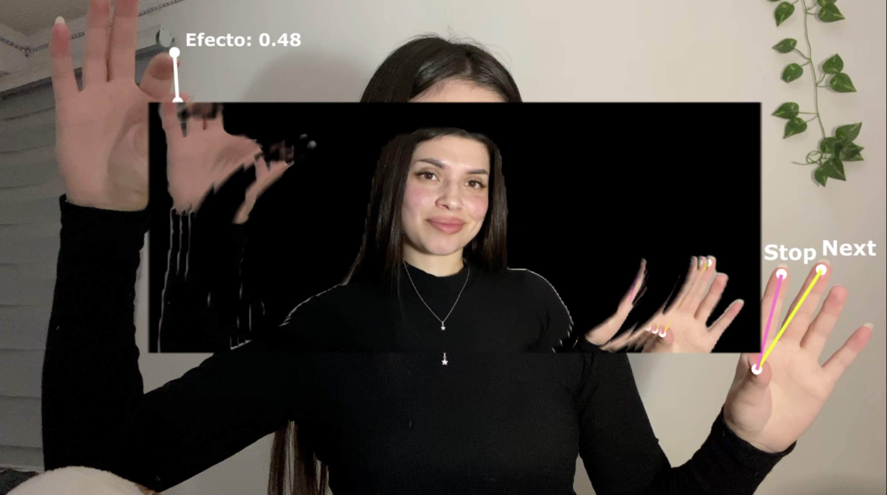
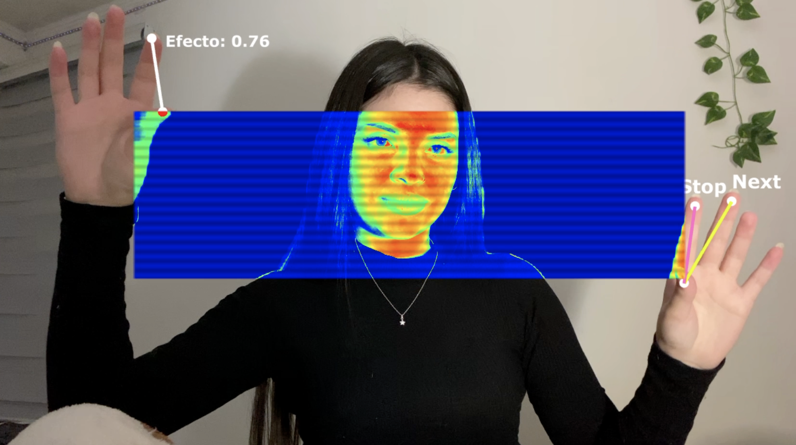
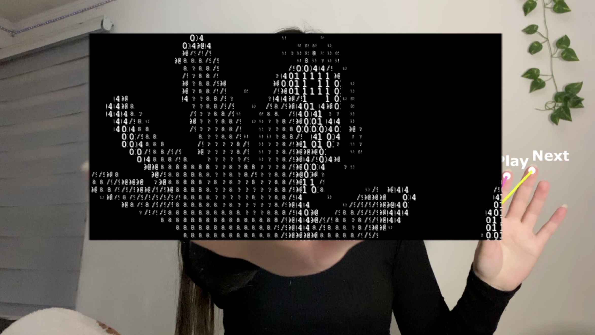
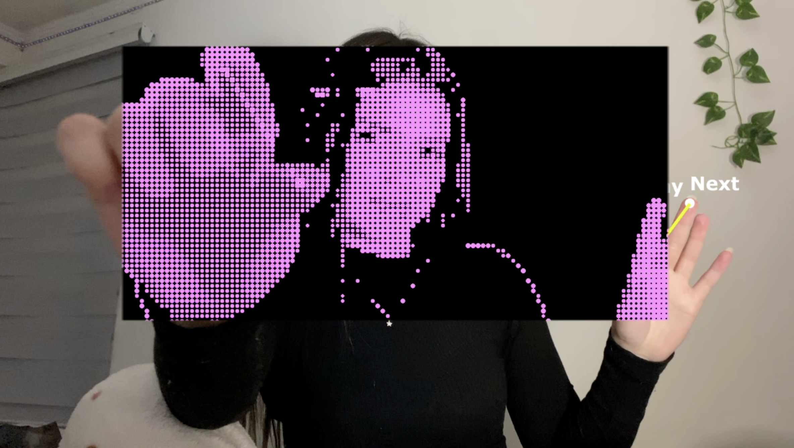

# UMBRAL
### instalación interactiva con hand tracking - TouchDesigner

---

## ¿De qué se trata?

Instalación interactiva en tiempo real desarrollada en TouchDesigner con hand tracking via MediaPipe. El participante usa sus manos para definir un rectángulo en el espacio frente a la cámara: la distancia y posición de los dedos índice determinan el tamaño y ubicación del marco. Dentro de él, la imagen se transforma mediante efectos visuales intercambiables. Fuera, la realidad permanece sin intervención. El proyecto propone al cuerpo, específicamente las manos, como el dispositivo que enmarca, filtra y transforma la realidad visible.

---

## Cómo funciona

| Gesto | Qué hace |
|-------|----------|
| Dedos índice de ambas manos | Definen el tamaño y posición del marco |
| Pinch dedo índice derecho | Congela el marco en el espacio |
| Pinch dedo medio derecho | Cambia el efecto activo |
| Pinch dedo índice izquierdo| Controla la intensidad del efecto |

---

## Efectos disponibles

| Efecto | Descripción |
|--------|-------------|
| **Thermal** | Falso mapa de calor tipo cámara infrarroja |
| **ASCII** | Caracteres tipográficos que representan el brillo de la imagen |
| **Puntos** | Halftone de círculos de color variable |
| **Efecto agua** | Textura tridimensional con escala dinámica |

---

## Montaje

La instalación se monta sobre una mesa. El computador corre TouchDesigner y procesa el hand tracking en tiempo real. La cámara apunta hacia el participante, quien se para frente a la cámara y ve su propia imagen proyectada en la pared, lo que significa que interactúa viéndose a sí mismo en la proyección, con el marco y los efectos superpuestos en tiempo real.

| Elemento | Descripción |
|----------|-------------|
| **Proyector** | Proyecta la salida de TouchDesigner en la pared |
| **Cámara** | Captura al participante en tiempo real |
| **Computador** | Corre TouchDesigner con el proyecto |
| **Mesa** | Soporte para el equipo |

---

## Imágenes

| | |
|---|---|
|  |  |
|  | |

---

## Stack técnico

| | |
|---|---|
| **Software** | TouchDesigner 2025 |
| **Tracking** | MediaPipe CHOP |
| **Cámara** | Webcam o cámara USB |
| **Lenguajes** | GLSL / Python |
| **OS** | macOS |

---

## Contexto
Desarrollado para [Processing Community Day](https://processingfoundation.org/) organizado por [LID UDP](https://www.instagram.com/lid.udp?igsh=YzQwcGppMnN5YW5h) Santiago 2026.

El proyecto surgió explorando hand tracking en TouchDesigner y terminó siendo una reflexión sobre cómo encuadramos lo que vemos. 

*UMBRAL explora el gesto como programa, el cuerpo como aparato, y el marco como umbral entre lo visible y lo transformado.*

---
Hecho por **Kora** · Santiago, Chile · 2026

<https://koranode.cl/>
